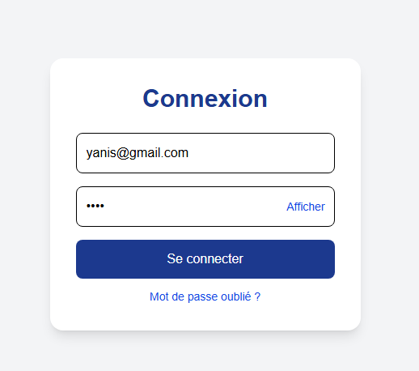
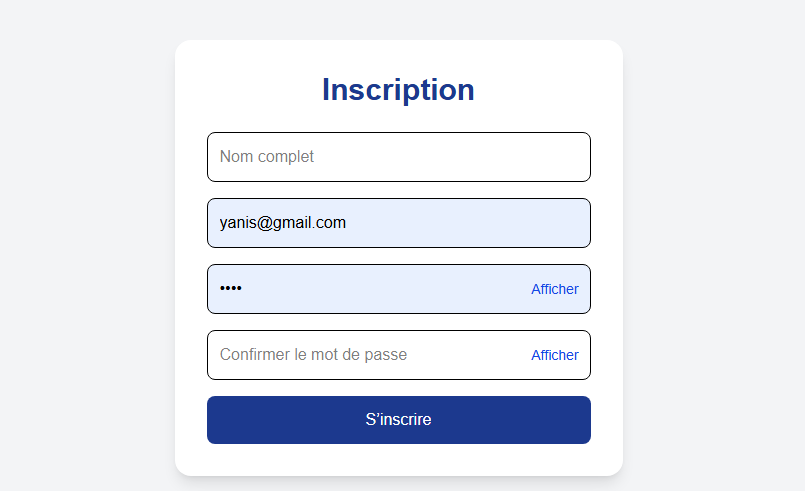
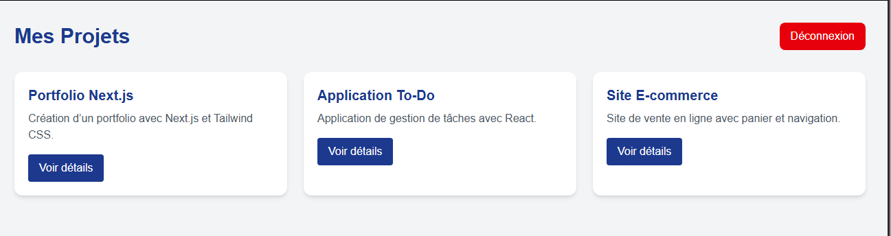
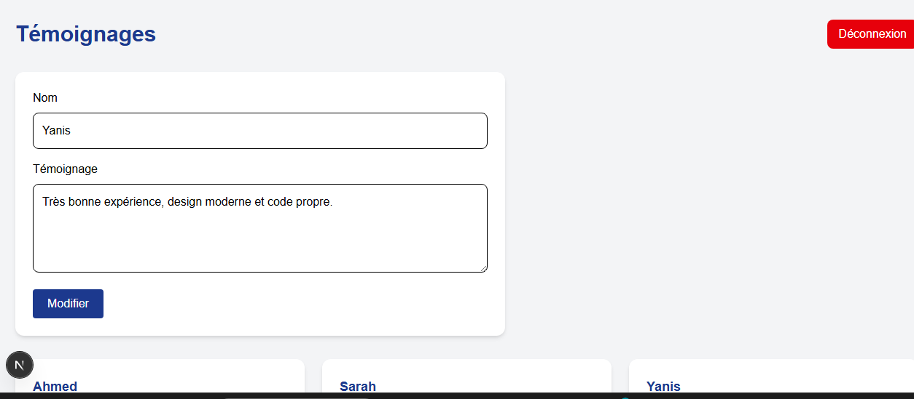

#  Mon Portfolio Next.js

##  Description

Ce projet est un portfolio développé avec Next.js.
Il permet à un utilisateur de s’inscrire, de se connecter et de consulter une liste de projets.

##  Fonctionnalités

* Inscription d’un utilisateur
* Connexion avec email et mot de passe
* Stockage des données avec localStorage
* Affichage des projets
* Page de détails pour chaque projet

##  Technologies utilisées

* Next.js
* React
* JavaScript
* CSS

##  Installation et lancement

1. Installer les dépendances :

```bash
npm install
```

2. Lancer le projet :

```bash
npm run dev
```

3. Ouvrir dans le navigateur :
   http://localhost:3000

##  Captures d’écran

### Page de connexion



###  Page d'inscription



###  Page des projets




### Témoignages



##  Améliorations possibles

* Ajouter un backend (Node.js / Express)
* Ajouter une base de données
* Améliorer le design et les animations

##  Auteur

Yanis messaoudene
